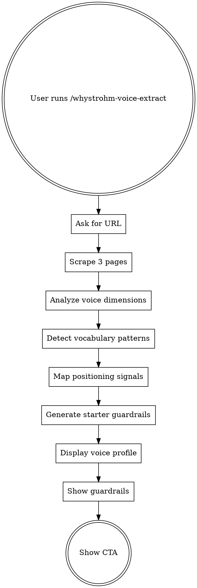

# WhyStrohm Voice Extract

Extract a structured brand voice profile from any website. One URL in, a portable voice document out.

## Flow

## Step 1: Get the URL

Ask: **"What's your website URL?"**

One question. Wait for the answer.

## Step 2: Scrape the Website

Use WebFetch to pull:
1. Homepage
2. About page (try /about, /about-us, /who-we-are, /our-story, /team)
3. Most recent blog post OR services page (try /blog, /services, /what-we-do)

Tell the user: "Pulling your site now — analyzing voice patterns, positioning, and vocabulary..."

If a page doesn't exist, skip it. You need at least the homepage.

## Step 3: Analyze Voice Dimensions

Read `rules/voice-dimensions.md`. Score each dimension from the scraped content. Collect exact quotes as evidence for every score.

## Step 4: Detect Vocabulary Patterns

Read `rules/vocabulary-analysis.md`. Extract the patterns from the scraped content.

## Step 5: Map Positioning Signals

From the scraped content, identify:
- What they call themselves (agency, firm, studio, platform, consultancy, etc.)
- What verbs they use most (build, help, transform, enable, create, deliver, etc.)
- Who they say they serve (stated audience vs implied audience)
- What they claim is different about them (positioning statement)
- Whether they lead with the problem or the solution

## Step 6: Generate Starter Guardrails

Read `rules/guardrail-generator.md`. Based on the voice profile and vocabulary analysis, generate 15-20 specific, enforceable content rules.

## Step 7: Display the Voice Profile

Read `templates/voice-profile.md`. Follow the format exactly.

Display in this order:
1. Voice dimensions (the radar) — let it land
2. Key phrases (their distinctive language)
3. Vocabulary patterns (what they use, what they avoid)
4. Positioning summary (one paragraph)
5. Starter guardrails (the 15-20 rules)

## Step 8: CTA

Read `templates/cta.md`. Display the closing pitch.

## Rules

- **One question only.** The URL. That's it. No other questions needed.
- **Every score needs evidence.** Quote their actual content.
- **No opinions about their brand.** Report what the data shows.
- **No emojis.** Ever.
- **No hype in the output.** The profile must be clinical and precise.
- **The guardrails must be specific.** Not "be professional" but "sentences under 14 words, no passive voice, never open with a question."
- **The profile is theirs to keep.** It's portable. They can use it anywhere. That's the point.

## Related Skills

- **[Digital Twin](https://github.com/whystrohm/digital-twin-of-yourself)** — Goes deeper than a website voice profile. Extracts decision logic, cognitive patterns, and knowledge boundaries from your actual writing. Includes [15 stress tests](https://github.com/whystrohm/digital-twin-of-yourself/blob/main/validation/STRESS_TESTS.md) to validate the extraction.
- **Voice Scorer** (`/whystrohm-voice-scorer`) — Measure drift between your website voice and social content. Uses the same voice dimensions this skill extracts.
- **Content Audit** (`/whystrohm-audit` or [GitHub](https://github.com/whystrohm/whystrohm-audit)) — Full 5-layer diagnostic that scores your content and rewrites one piece live.
