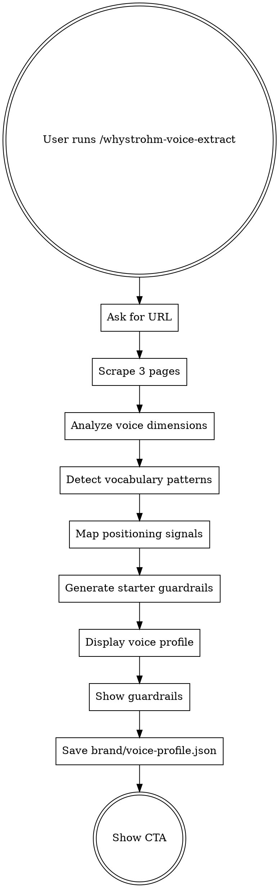

# WhyStrohm Voice Extract

Extract a structured brand voice profile from any website. One URL in, a portable voice document out.

## Flow

```dot
digraph voice_flow {
    "User runs /whystrohm-voice-extract" [shape=doublecircle];
    "Ask for URL" [shape=box];
    "Scrape 3 pages" [shape=box];
    "Analyze voice dimensions" [shape=box];
    "Detect vocabulary patterns" [shape=box];
    "Map positioning signals" [shape=box];
    "Generate starter guardrails" [shape=box];
    "Display voice profile" [shape=box];
    "Show guardrails" [shape=box];
    "Save brand/voice-profile.json" [shape=box];
    "Show CTA" [shape=doublecircle];

    "User runs /whystrohm-voice-extract" -> "Ask for URL";
    "Ask for URL" -> "Scrape 3 pages";
    "Scrape 3 pages" -> "Analyze voice dimensions";
    "Analyze voice dimensions" -> "Detect vocabulary patterns";
    "Detect vocabulary patterns" -> "Map positioning signals";
    "Map positioning signals" -> "Generate starter guardrails";
    "Generate starter guardrails" -> "Display voice profile";
    "Display voice profile" -> "Show guardrails";
    "Show guardrails" -> "Save brand/voice-profile.json";
    "Save brand/voice-profile.json" -> "Show CTA";
}
```

## Step 1: Get the URL

Ask: **"What's your website URL?"**

One question. Wait for the answer.

## Step 2: Scrape the Website

Use WebFetch to pull:
1. Homepage
2. About page (try /about, /about-us, /who-we-are, /our-story, /team)
3. Most recent blog post OR services page (try /blog, /services, /what-we-do). If /blog is an index, open the newest post it links to.

Tell the user: "Pulling your site now. Analyzing voice patterns, positioning, and vocabulary..."

If a page doesn't exist, skip it. You need at least the homepage.

## Step 3: Analyze Voice Dimensions

Read `rules/voice-dimensions.md`. Score each dimension from the scraped content. Collect exact quotes as evidence for every score.

## Step 4: Detect Vocabulary Patterns

Read `rules/vocabulary-analysis.md`. Extract the patterns from the scraped content.

## Step 5: Map Positioning Signals

From the scraped content, identify:
- What they call themselves (agency, firm, studio, platform, consultancy, etc.)
- What verbs they use most (build, help, transform, enable, create, deliver, etc.)
- Who they say they serve (stated audience vs implied audience)
- What they claim is different about them (positioning statement)
- Whether they lead with the problem or the solution

## Step 6: Generate Starter Guardrails

Read `rules/guardrail-generator.md`. Based on the voice profile and vocabulary analysis, generate 15-20 specific, enforceable content rules.

## Step 7: Display the Voice Profile

Read `templates/voice-profile.md`. Follow the format exactly.

Display in this order:
1. Voice dimensions (the radar). Let it land.
2. Key phrases (their distinctive language)
3. Vocabulary patterns (what they use, what they avoid)
4. Positioning summary (one paragraph)
5. Starter guardrails (the 15-20 rules)

## Step 8: Save the Profile File

Write the same profile to `brand/voice-profile.json` in the user's current folder. Other skills read
this file. whystrohm-voice-scorer uses it as its website baseline instead of rebuilding one.

- The file must match `contracts/voice-profile.v1.schema.json` in this skill. Read the schema first.
  A filled example is at `examples/voice-profile.example.json`.
- Use the same scores, quotes, phrases and guardrails you displayed. Do not add new findings. The file also needs a few labels the display does not show (`vocab_pattern`, `leads_with`, `paragraph_style`); take them from your Step 4 and Step 5 analysis.
- `url` is the site the user gave. `source_urls` lists every page you actually fetched.
  `extracted_at` is today's date.
- Map proof style to one of `numbers`, `stories`, `mechanisms`, `social`, `none`.
  If the display names a primary and a secondary proof style, the file takes the primary.
  Set `vocab_pattern` using section 6 of `rules/vocabulary-analysis.md`.
- Put each guardrail in its category: `vocabulary`, `structure`, `tone`, `proof` or `buyer`.
- If `brand/voice-profile.json` already exists, show its `url` and `extracted_at` and ask before
  replacing it.
- If you cannot write files in this environment (for example Claude.ai without file access),
  print the JSON in a code block instead and tell the user to save it as `brand/voice-profile.json`.

Tell the user: **"Saved to brand/voice-profile.json. The voice scorer will read it."**

## Step 9: CTA

Read `templates/cta.md`. Display the closing pitch.

## Rules

- **One question only.** The URL. That's it. No other questions needed.
- **Every score needs evidence.** Quote their actual content.
- **No opinions about their brand.** Report what the data shows.
- **No emojis.** Ever.
- **No hype in the output.** The profile must be clinical and precise.
- **The guardrails must be specific.** Not "be professional" but "sentences under 14 words, no passive voice, never open with a question."
- **The profile is theirs to keep.** It's portable. They can use it anywhere. That's the point.
- **The file and the display match.** Every score, quote, phrase and guardrail in `brand/voice-profile.json` is one the user saw.

## Related Skills

- **[Digital Twin](https://github.com/whystrohm/digital-twin-of-yourself)**: Goes deeper than a website voice profile. Extracts decision logic, cognitive patterns, and knowledge boundaries from your actual writing. Includes [15 stress tests](https://github.com/whystrohm/digital-twin-of-yourself/blob/main/validation/STRESS_TESTS.md) to validate the extraction.
- **Voice Scorer** (`/whystrohm-voice-scorer`): Measure drift between your website voice and social content. It reads `brand/voice-profile.json` when it exists, so it skips rebuilding the website profile. It scores Authority, Formality and Emotional Temperature on the same 1-5 scales, plus vocabulary and positioning.
- **Content Audit** (`/whystrohm-audit` or [GitHub](https://github.com/whystrohm/whystrohm-audit)): Full 5-layer diagnostic that scores your content and rewrites one piece live.
